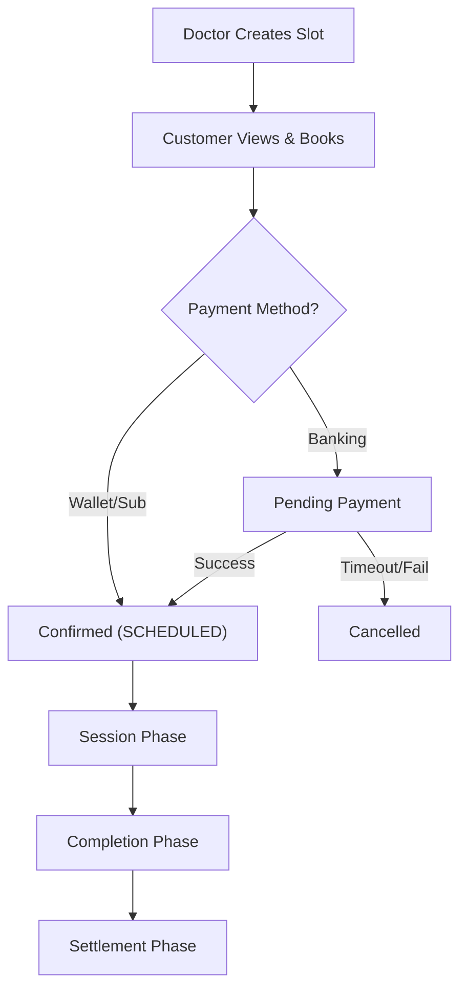
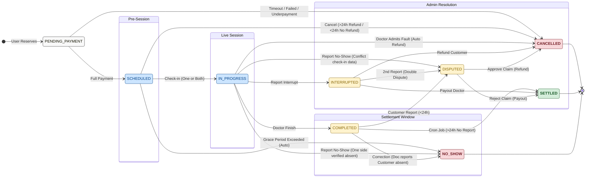

# Telemedicine Booking & Consultation Flow

This document outlines the complete lifecycle of an appointment within the Skinalyze ecosystem, from scheduling to financial settlement.

---

## 🔄 Flow Overview

---

## Appointment Lifecycle State Diagram

---

## 1️⃣ Phase 1: Booking Phase

### 1. Doctor Creates Schedule
*   **Actor**: Doctor
*   **Action**: Logs in → Schedule Management → Selects time slots → Creates Slots.
*   **Result**: Slots are visible to users.

### 2. Customer Views Schedule
*   **Actor**: Customer
*   **Action**: Logs in → Views Doctor Profile → Sees `AVAILABLE` slots.

### 3. Customer Reserves a Slot
*   **Actor**: Customer
*   **Action**: Selects a specific slot.
*   **System**: Temporarily locks the slot (Status: `BOOKED`).

### 4. Payment Processing
The customer chooses a payment method:

#### 4.1. Wallet or Subscription
*   **Action**: Direct deduction.
*   **Result**: Proceed to **Step 5**.

#### 4.2. Bank Transfer (Banking/SePay)
*   **Status**: `PENDING_PAYMENT`
*   **Process**:
    1.  System generates QR code.
    2.  Customer transfers money.
    3.  **Webhook Handling**:
        *   ✅ **Sufficient Funds**: Confirm payment → Proceed to **Step 5**.
        *   ❌ **Insufficient Funds**: Cancel order, refund partial amount to Wallet, release Slot.
        *   ⏳ **Timeout (5 mins)**: Cancel order, release Slot.

### 5. Booking Confirmation
*   **System Action**: Changes appointment status to `SCHEDULED`.
*   **Notification**: Sends confirmation to both parties.

---

## 2️⃣ Phase 2: Session Phase

### 6. Create Meeting Room
*   **System (Cron)**: Automatically generates Google Meet link before appointment time.

### 7. Check-in (Join Room)
*   **Action**: Both Customer and Doctor click "Check-in & Join meeting" at the scheduled time.
*   **System**: Records `JoinedAt` timestamp for both.
*   **Status Change**: `IN_PROGRESS`.

### 8. Incident Handling
*   **Type A: Happy Path** 🟢
    *   Call proceeds smoothly.
*   **Type B: Interrupt** 🔴
    *   One party clicks "Report interruption" (customer/doctor/platform issue).
    *   **Status**: `INTERRUPTED`.
    *   **Financials**: Funds are held.
*   **Type C: No-Show** 🚫
    *   One party joins and waits, the other does not.
    *   Active party clicks "Report no-show".
    *   **System Check**:
        *   **No Check-in Record** (No `JoinedAt`): Status -> **`NO_SHOW`**. Automatic refund/penalty processing.
        *   **Has Check-in Record** (Has `JoinedAt`): Status -> **`DISPUTED`**. Flagged for Admin review (since they joined but session failed).

---

## 3️⃣ Phase 3: Completion Phase

### 9. Complete Appointment
*   **Actor**: Doctor
*   **Action**: Clicks "Finish" button.
*   **Status**: `COMPLETED`.
*   *Note*: Funds are **not yet** added to the doctor’s wallet.

### 10. Create Treatment Routine
*   **Context**: From the completed appointment details screen.
*   **Action**:
    1.  Doctor clicks "Create treatment routine" or "View/Update treatment routine" if an appointment is follow-up.
    2.  Selects products (inventory) or add a external products, enters dosage, frequency, and notes.
    3.  Clicks "Create/Update".

### 11. Customer Receives Results
*   **Action**: Customer receives notification.
*   **Result**: Can view the new treatment plan in appointment details.

---

## 4️⃣ Phase 4: Settlement Phase

### 12. Dispute Window (24h)
*   **Scenario A: No Dispute**
    *   Nothing happens for 24 hours after completion.
*   **Scenario B: Dispute Raised**
    *   Customer clicks "Report issue".
    *   **Status**: `DISPUTED`.
    *   **Action**: Admin intervenes (Refund User OR Pay Doctor).

### 13. Automatic Settlement (Cron Job)
*   **Trigger**: Scans appointments with status `COMPLETED` > 24 hours.
*   **Calculation**: `Doctor Earnings = Booking Fee - Platform Fees`.
*   **Action**: Credits funds to Doctor's Wallet.
*   **Final Status**: `SETTLED`.

---

## 📊 Status Definitions

### 🕒 Availability Slot Statuses
| Status | Description |
| :--- | :--- |
| **AVAILABLE** | Slot is open for booking. |
| **BOOKED** | Slot is reserved/locked (appointment creation in progress or completed). |

### 📅 Appointment Statuses
| Status | Description |
| :--- | :--- |
| **PENDING_PAYMENT** | Slot reserved, awaiting bank transfer confirmation. |
| **SCHEDULED** | Payment confirmed, meeting link pending/ready. |
| **IN_PROGRESS** | Participants checked in, call active. |
| **COMPLETED** | Clinical session finished, funds in escrow. |
| **INTERRUPTED** | Technical failure reported. |
| **DISPUTED** | Customer raised a complaint. Admin review required. |
| **SETTLED** | Funds transferred to doctor’s wallet, process finished |
| **CANCELLED** | Booking aborted (User action or Timeout). |
| **NO_SHOW** | One party failed to attend. |
