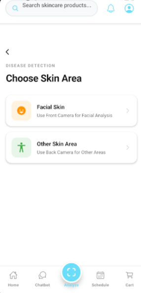
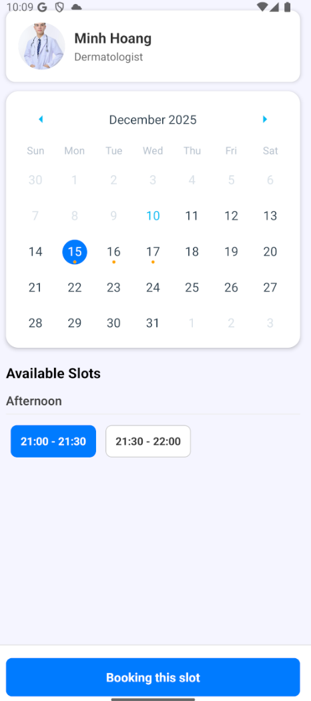
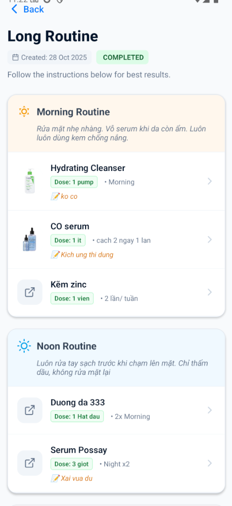
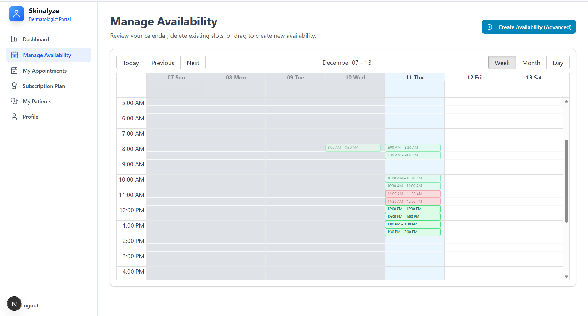
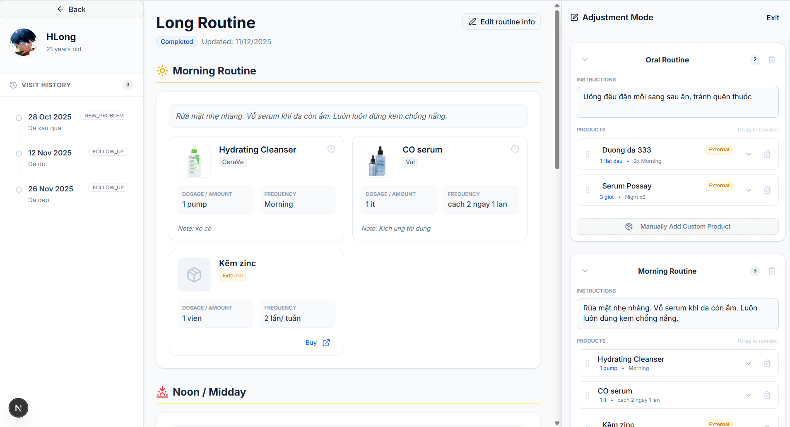
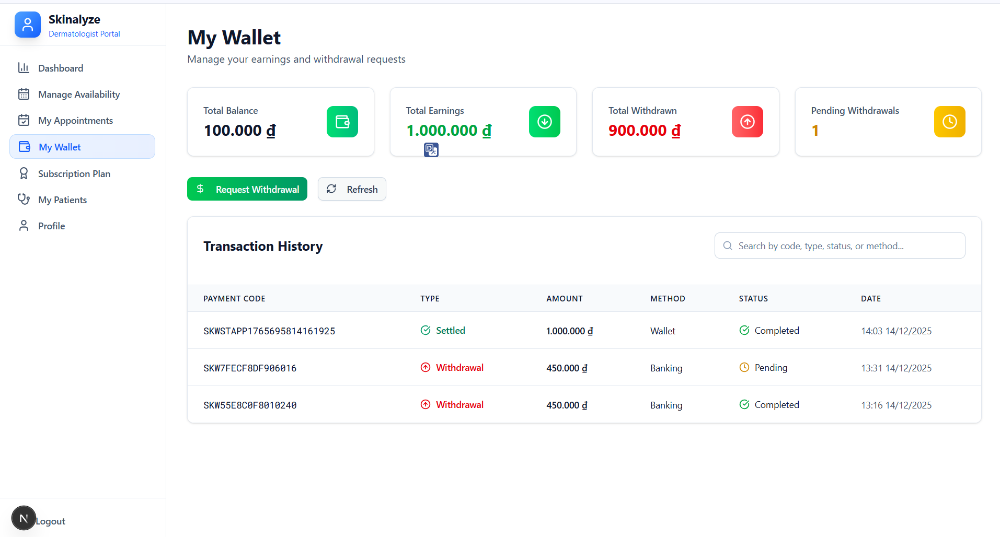

# Skinalyze – AI-Driven Teledermatology & E-commerce Ecosystem


> **Bridging the gap between patients and dermatologists through AI technology.**

**Skinalyze** is a comprehensive HealthTech ecosystem that integrates **AI Skin Analysis**, **Telemedicine**, and a **Specialized E-commerce Marketplace**. It empowers users to understand their skin health via computer vision, consult with professionals, and purchase personalized treatments in a seamless cross-platform experience.

---

## System Architecture

The Skinalyze ecosystem consists of three interconnected applications:

*   **Backend Core (NestJS)**: The central nervous system handling business logic, AI processing, real-time communication, and data persistence.
*   **Web Portal (Next.js)**: A responsive dashboard for Staff, Dermatologists, and Admins to manage appointments, products, and analytics.
*   **Mobile App (React Native)**: A user-centric mobile experience for on-the-go skin scanning, shopping, and consultation.

---

## Key Features

### AI Skin Diagnostics & Analysis
*   **Computer Vision Engine**: Analyzes user photos to detect skin conditions (acne, pigmentation, wrinkles) using **MediaPipe (Mobile)** and server-side validation.
*   **Preliminary Diagnosis**: Generates instant health reports with disease probability maps and severity assessments.
*   **Smart Recommendations**: Automatically suggests products and treatment routines based on analysis results.

### Telemedicine & Booking System
*   **Smart Scheduling**: "Drag & Drop" availability management for doctors and real-time slot booking for patients.
*   **Consultation Types**: Supports both **New Problem** (initial checkup) and **Follow-up** (tracking progress).
*   **Pre-Consultation Insight**: Aggregates patient self-reports and AI scan history for doctors before the meeting.
*   **Video Integration**: Seamless Google Meet link generation and management.

### Personalized Treatment & Tracking
*   **Dynamic Routines**: Doctors create detailed skincare routines (Morning, Noon, Evening, Oral, Other).
*   **Time-Travel Timeline**: A sophisticated versioning system that reconstructs historical treatment plans at any specific point in time using `createdAt`/`updatedAt` logic.
*   **Grace Period Updates**: Intelligent editing mechanism allowing doctors to fix prescription errors within **24h** without polluting the patient's medical history.
*   **Automated Reminders**: Cron-job based notifications to remind users of their daily skincare steps.

### Specialized E-commerce Marketplace
*   **Full-Cycle Shopping**: Product browsing, cart management, and secure checkout.
*   **Flexible Prescription**: Doctors can prescribe internal products or add **External Links** for items not in stock.
*   **Payment Ecosystem**: Integrated **Sepay** for bank transfers and an **Internal Wallet System** for seamless transactions.
*   **Order Tracking**: Real-time status updates from processing to delivery.

---

## Tech Stack

### Backend (Server-Side)
| Category | Technology | Description |
| :--- | :--- | :--- |
| **Framework** | **NestJS** (Node.js) | Modular, scalable architecture. |
| **Language** | **TypeScript** | Strict type safety. |
| **Database** | **MySQL** via **TypeORM** | Relational data modeling (One-to-One, Many-to-Many). |
| **Caching & Queue** | **Redis** | Caching session data and managing background jobs. |
| **Real-time** | **Socket.io** / **WebSocket** | Instant notifications and chat features. |
| **Scheduling** | **@nestjs/schedule** (Cron) | Reminders, link generation, and payment checks. |
| **Storage** | **Cloudinary** | Optimized image storage for skin scans. |
| **Auth** | **JWT** & **RBAC** | Secure authentication and Role-Based Access Control. |

### Frontend (Web Portal)
| Category | Technology | Description |
| :--- | :--- | :--- |
| **Framework** | **Next.js 15** (App Router) & **React 19** | Server-Side Rendering (SSR) for SEO and performance. |
| **Styling** | **Tailwind CSS v4** & **shadcnUI** | Accessible, responsive design system. |
| **State** | **React Context API** | Global state management. |
| **Forms** | **React Hook Form** + **Zod** | Robust validation. |
| **Visualization** | **Recharts** | Analytics for Admin dashboards. |
| **Scheduling** | **react-big-calendar** | Interactive calendar for doctors. |

### Mobile (User App)
| Category | Technology | Description |
| :--- | :--- | :--- |
| **Framework** | **React Native** (0.81) & **Expo SDK 54** | Cross-platform mobile development. |
| **Navigation** | **Expo Router v6** | File-based routing. |
| **AI Engine** | **@mediapipe/tasks-vision** | On-device real-time skin analysis. |
| **UI Components** | **NativeBase**, **Reanimated** | Smooth animations and consistent UI. |
| **Native Features** | **Expo Camera**, **Notifications**, **AV** | Hardware integration. |

---

## Technical Highlights & Solutions

*   **Atomic Transactions**: Implemented ACID-compliant transactions for critical operations like Wallet Payments and Appointment Booking to prevent race conditions and data inconsistency.
*   **Complex Timeline Logic**: Developed a "Time-Travel" algorithm to reconstruct patient treatment history accurately by querying snapshots based on temporal data.
*   **Smart "Grace Period" Editing**: Solved database pollution by allowing in-place updates for doctor's notes within 24 hours, while enforcing strict versioning for historical changes.
*   **Hybrid AI Analysis**: Combined on-device processing (Mobile MediaPipe) for speed with server-side validation for accuracy.

---

## Getting Started

### Prerequisites
*   Node.js (v18+)
*   npm or yarn
*   MySQL & Redis instances
*   Expo Go (for mobile testing)

### Installation

**1. Clone the repository**
```bash
git clone https://github.com/trinhlong183/Skinalyze-AI-Driven-Teledermatology-E-commerce-Ecosystem.git
cd Skinalyze-AI-Driven-Teledermatology-E-commerce-Ecosystem
```

**2. Setup Backend**
```bash
cd backend
npm install
# Configure .env file
npm run start:dev
```

**3. Setup Admin/Doctor Portal**
```bash
cd frontend
npm install
npm run dev
```

**4. Setup Mobile App**
```bash
cd mobile
npm install
npx expo start
```

---

## Application Previews

| AI Skin Analysis | Booking System | Patient Treatment View |
| :---: | :---: | :---: |
|  |  |  |

| Doctor Scheduling | Treatment Management | Wallet & Payments |
| :---: | :---: | :---: |
|  |  |  |